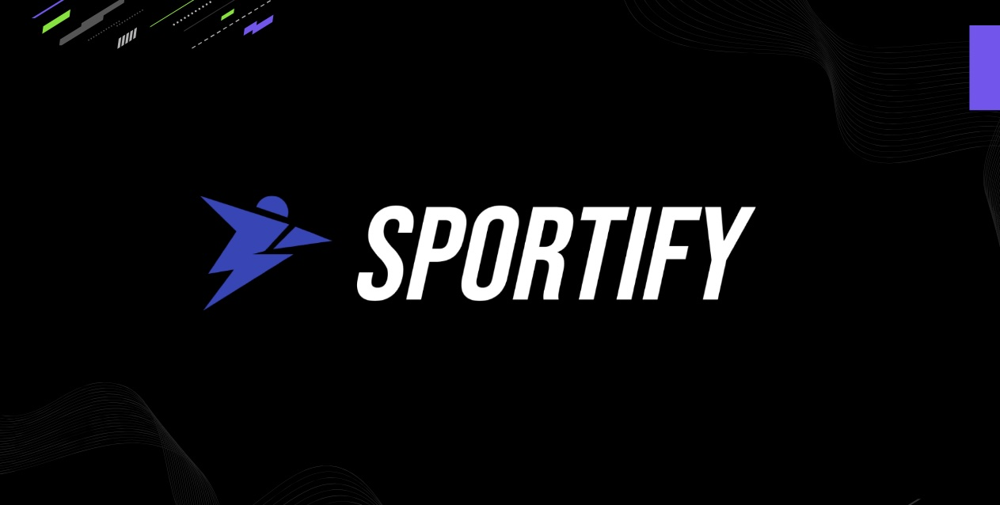

<a name="readme-top"></a>

<!-- HEADER IMAGE -->


<!-- TABLE OF CONTENTS -->
# 📗 Table of Contents

- [📖 About the Project](#about-project)
  - [🛠 Built With](#built-with)
    - [Tech Stack](#tech-stack)
    - [Key Features](#key-features)
  - [🚀 Live Demo](#live-demo)
- [💻 Getting Started](#getting-started)
  - [Setup](#setup)
  - [Prerequisites](#prerequisites)
  - [Install](#install)
  - [Usage](#usage)
- [👥 Authors](#authors)
- [📝 License](#license)

<!-- PROJECT DESCRIPTION -->
# 📖 Sportify <a name="about-project"></a>

**Sportify** is an innovative web application designed to enhance the experience of sports enthusiasts by providing a platform to explore, compare, and engage with a variety of sports products. Whether you're a professional athlete, a fitness enthusiast, or a casual sports fan, Sportify offers a comprehensive catalog of sports equipment, apparel, and accessories to meet your needs.

## 🛠 Built With <a name="built-with"></a>

### Tech Stack <a name="tech-stack"></a>

#### Frontend
- **React.js:** A JavaScript library for building user interfaces. React is used for creating dynamic and interactive web pages, with a component-based architecture that makes the code more reusable and easier to maintain.

#### Backend
- **Node.js:** A JavaScript runtime built on Chrome's V8 JavaScript engine. Node.js is used for building fast and scalable server-side applications.
- **Express.js:** A minimal and flexible Node.js web application framework that provides a robust set of features for web and mobile applications. Express is used for setting up the server and handling routes.

#### Database
- **MongoDB:** A NoSQL database program that uses JSON-like documents with optional schemas. MongoDB is used for storing product information and user data.

#### Middleware
- **Axios:** A promise-based HTTP client for the browser and Node.js. Axios is used for making API requests to the backend server.
- **CORS:** Middleware that allows restricted resources on a web page to be requested from another domain outside the domain from which the resource originated. CORS is used for enabling cross-origin requests.

#### Authentication
- **JWT (JSON Web Token):** A compact, URL-safe means of representing claims to be transferred between two parties. JWT is used for securely transmitting information between the client and server as JSON objects.

#### Styling
- **CSS:** Used for styling the web pages to ensure a good user experience.
- **Bootstrap:** A popular CSS framework that helps to create responsive and mobile-first web pages.

#### Environment Variables
- **dotenv:** A zero-dependency module that loads environment variables from a `.env` file into `process.env`. Used for managing configuration settings.

#### Additional Tools
- **Mongoose:** An ODM (Object Data Modeling) library for MongoDB and Node.js. Mongoose provides a straightforward, schema-based solution to model application data.

This tech stack enables Sportify to be a dynamic, interactive, and user-friendly platform for sports enthusiasts, providing robust functionality and a seamless user experience.

### Key Features <a name="key-features"></a>

- **Product Catalog**
- **Product Search**
- **Product Filtering**
- **Product Details**
- **User Comments**
- **Like/Dislike Comments**

<p align="right">(<a href="#readme-top">back to top</a>)</p>

<!-- LIVE DEMO -->
## 🚀 Live Demo <a name="live-demo"></a>

- [Live Demo Link](https://yourdeployedapplicationlink.com)

<p align="right">(<a href="#readme-top">back to top</a>)</p>

<!-- GETTING STARTED -->
## 💻 Getting Started <a name="getting-started"></a>

To get a local copy up and running, follow these steps.

### Prerequisites

Before you begin working on the Sportify project, ensure you have the following prerequisites installed and configured:

- **Node.js and npm:**
  - Node.js: Ensure you have Node.js installed. You can download it from [Node.js](https://nodejs.org/).
  - npm: Node.js comes with npm (Node Package Manager), which you will use to manage project dependencies.

- **MongoDB:**
  - Ensure you have MongoDB installed and running. You can download and install MongoDB from [MongoDB](https://www.mongodb.com/try/download/community).

- **Git:**
  - Ensure you have Git installed for version control. You can download it from [Git](https://git-scm.com/).

- **Code Editor:**
  - A code editor like [Visual Studio Code (VSCode)](https://code.visualstudio.com/), Sublime Text, or Atom.

- **Postman:**
  - A tool for testing APIs. You can download it from [Postman](https://www.postman.com/downloads/).

- **Basic Knowledge:**
  - Familiarity with JavaScript, React.js, Node.js, Express.js, and MongoDB.
  - Understanding of RESTful APIs and how to interact with them.

### Setup

1. **Clone the Repository:**
   ```sh
   git clone https://github.com/your-username/sportify.git
Navigate to the Project Directory:
sh
Copy code
cd sportify
Install
Install Backend Dependencies:

sh
Copy code
cd backend
npm install
Install Frontend Dependencies:

sh
Copy code
cd ../frontend
npm install
Set Up Environment Variables
Create a .env file in the backend directory and add the following:

env
Copy code
PORT=5000
MONGO_URI=your_mongo_database_uri
Usage
Start the Backend Server:

sh
Copy code
cd backend
npm start
Start the Frontend Server:

sh
Copy code
cd ../frontend
npm start
Open the Application:
Open your browser and navigate to http://localhost:5000.

Explore Features:

Browse and search for products.
View detailed product information.
Add products to the cart (as a customer).
Add, update, or delete products (as an admin).
Engage with the community by leaving comments and liking or disliking others' comments.
<p align="right">(<a href="#readme-top">back to top</a>)</p>
<!-- AUTHORS -->
👥 Authors <a name="authors"></a>
👤 Tshwetso K Mokgatlhe

GitHub: @TshwetsoMo
Email: 221411@virtualwindow.co.za
LinkedIn: Tshwetso K Mokgatlhe
👤 Tristan Storm

GitHub: @TristanStormDesign
Twitter: @twitterhandle
LinkedIn: Tristan Storm
👤 Jarryd Carelse

GitHub: @githubhandle
Twitter: @twitterhandle
LinkedIn: Jarryd Carelse
<p align="right">(<a href="#readme-top">back to top</a>)</p>
<!-- LICENSE -->
📝 License <a name="license"></a>
This project is MIT licensed.

<p align="right">(<a href="#readme-top">back to top</a>)</p>
```
Replace "path/to/your/header-image.jpg" with the actual path to your header image file. This updated README should now be properly formatted for your GitHub repository, including a header image at the start.
